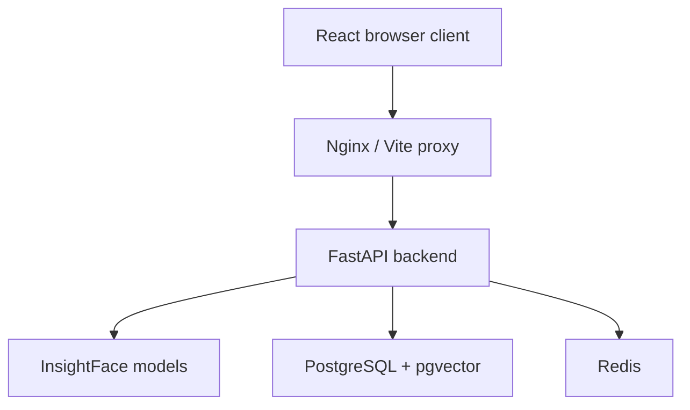

# Architecture

## Components

| Component | Responsibility |
|---|---|
| React frontend | Credentials, webcam capture, session state, guarded dashboard |
| Nginx/Vite | Serves the frontend and proxies `/api` requests |
| FastAPI | Validation, authentication decisions, token issuance, API responses |
| InsightFace | Face detection and 512-dimensional ArcFace embeddings |
| PostgreSQL/pgvector | Users and one biometric template per user |
| Redis | Login rate limiting and revoked access-token identifiers |

## Registration

1. The browser captures the user's details and face.
2. `POST /auth/register` validates both inputs.
3. The face pipeline decodes the image, requires exactly one detected face, runs
   the liveness hook, and normalizes the recognition embedding.
4. The user and embedding are committed in one transaction.
5. Only then does the backend issue access and refresh tokens.

## Login

1. The browser submits email, password, and a face capture together.
2. The backend verifies the password.
3. The face pipeline extracts a normalized embedding from the capture.
4. The backend calculates cosine similarity against that user's stored template.
5. A score at or above `SIMILARITY_THRESHOLD` produces JWTs; a lower score
   returns `401 Unauthorized` without issuing tokens.

## Security boundaries

- Passwords are hashed with bcrypt.
- JWT access tokens expire after 15 minutes by default.
- Logout stores the access token's unique identifier in Redis, and authenticated
  routes reject identifiers on that revocation list.
- Authentication endpoints are rate-limited per client IP and route.
- Registration does not leave an account behind if biometric persistence fails.
- Input schemas reject malformed, unusually small, and oversized image payloads.
- Templates store normalized embeddings rather than source face images.

## Known limitation: liveness

`app/ml/anti_spoof/silent_face.py` is an explicit development placeholder. It
currently returns a perfect liveness score for every detected face, so printed
photos and screen replays are not blocked. A production system must replace it
with a tested anti-spoofing model and calibrate it for its cameras and operating
conditions.
